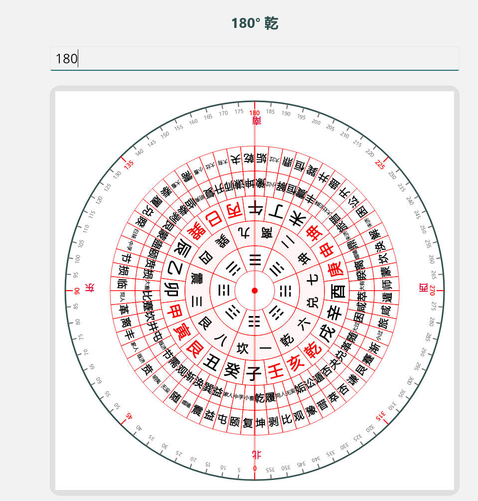

## ⚖️ 开源与商业授权声明 / Dual Licensing

本项目采用**双重许可 (Dual Licensing)** 模式分发。

### 💡 开源用途 / Open Source Use
* **协议 / License**: `GNU AGPLv3`
* **说明**: 如果您的项目完全开源、非盈利，或者您的商业项目**也完全采用 AGPL 3.0 协议开源**（包括您依托本项目构建的云端服务、小程序、App 源码），您可以免费使用。
* *If your project is open-source, non-commercial, or your repository is also licensed under AGPLv3 (including your cloud backend, mini-programs, or App source code), you can use this library for free.*

### 💰 商业用途 / Commercial Use
* **说明**: 如果您希望将本项目嵌入到**闭源商业软件、付费下载的应用、带有广告的小程序、商业风水/算命 SaaS 服务**中，为了保护您的商业核心机密，您**必须**购买我们的 **【商业闭源授权】**。
* *If you wish to integrate this library into closed-source commercial software, paid applications, mini-programs with ads, or commercial SaaS services, you **MUST** purchase a **Commercial License** to protect your own proprietary source code.*

---

## 📬 商务合作联系 / Contact

* **Email**: `Jockeyvb@gmail.com`
* **WeChat / 微信**: `Jockeyvb1` *(Please specify "CompassEx" when adding / 添加请备注罗盘库)*

# 调用范例
需要在加载时首先调用全局静态方法：
```csharp

	CompassEx.Comm.Comm.AllInit();//初始化数据 
	
```

# 示例
<div align="center">
   
</div>