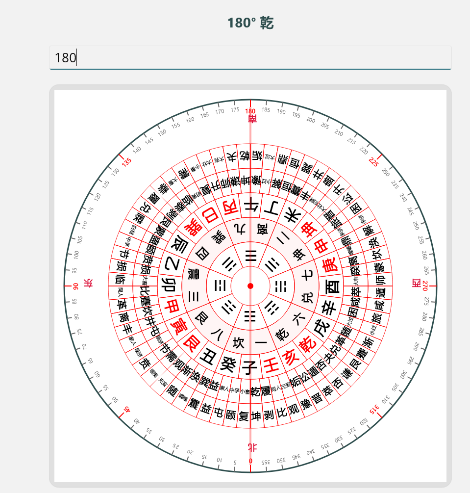
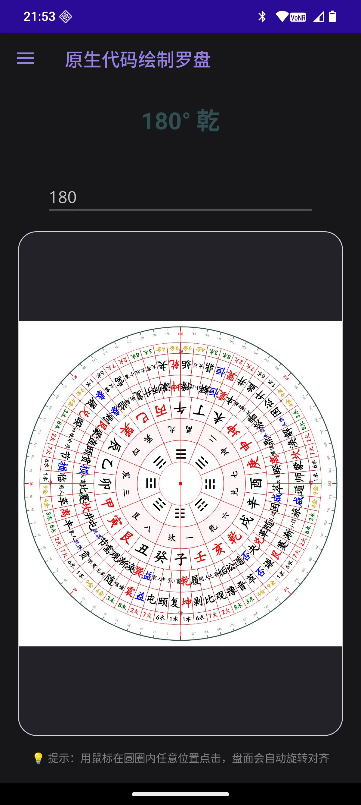

## ⚖️ 开源与商业授权声明 / Dual Licensing

本项目采用**双重许可 (Dual Licensing)** 模式分发。

### 💡 开源用途 / Open Source Use
* **协议 / License**: `GNU AGPLv3`
* **说明**: 如果您的项目完全开源、非盈利，或者您的商业项目**也完全采用 AGPL 3.0 协议开源**（包括您依托本项目构建的云端服务、小程序、App 源码），您可以免费使用。
* *If your project is open-source, non-commercial, or your repository is also licensed under AGPLv3 (including your cloud backend, mini-programs, or App source code), you can use this library for free.*

### 💰 商业用途 / Commercial Use
* **说明**: 如果您希望将本项目嵌入到**闭源商业软件、付费下载的应用、带有广告的小程序、商业营利应用 SaaS 服务**中，为了保护您的商业核心机密，您**必须**购买我们的 **【商业闭源授权】**。
* *If you wish to integrate this library into closed-source commercial software, paid applications, mini-programs with ads, or commercial SaaS services, you **MUST** purchase a **Commercial License** to protect your own proprietary source code.*

---

## 📬 商务合作联系 / Contact

* **Email**: `Jockeyvb@gmail.com`
* **WeChat / 微信**: `Jockeyvb1` *(Please specify "CompassEx" when adding / 添加请备注罗盘库)*

# 暂未发布至
 

# 算法说明
[点击查看在线 API 文档](https://jockeyvb.github.io/CompassEx/)

# 示例

winUI: 
   
   AndroidUI: 
   

## 免责声明

本库仅提供客观数值计算能力，不包含吉凶、运势、祸福判断逻辑，禁止将本库用于封建迷信、命理预测相关经营活动。

## 🛠️ 第三方組件與致謝 (Third-Party Components)

本項目在開發過程中引用或依賴了以下優秀的開源組件，特此向原作者致謝：

*   **[tyme4net](https://github.com/6tail/tyme4net)** (v1.5.0) · [MIT License](https://github.com/6tail/tyme4j/blob/master/LICENSE)
    *   **用途**：用於處理國學、陰陽歷、幹支紀年等傳統曆法與時間計算。
*   **[FreeSql](https://github.com/dotnetcore/FreeSql)** (v3.2.855) · [MIT License](https://github.com/dotnetcore/FreeSql/blob/master/LICENSE)
    *   **用途**：功能強大的對象關係映射（O/RM）框架，支持全自動化功能、動態表達式解析，用於高效的多資料庫訪問、監控與交互。
*   **[Newtonsoft.Json](https://github.com)** (v13.0.4) · [MIT License](https://github.com/JamesNK/Newtonsoft.Json/blob/master/LICENSE.md)
    *   **用途**：高性能的 JSON 序列化與反序列化處理庫。

